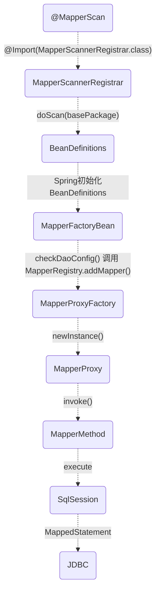

# mybatis-spring intergration 

MyBatis与springboot整合的入口, 是通过`@MapperScan`注解, 告诉Spring要扫描并代理的`Mapper`接口
```java
@MapperScan(basePackages = "tk.mybatis.sample.mapper")
@SpringBootApplication
public class SampleMapperApplication implements CommandLineRunner {

    @Autowired
    private CountryMapper countryMapper;

    public static void main(String[] args) {
        SpringApplication.run(SampleMapperApplication.class, args);
    }
}
```

让我们看看`@MapperScan`注解做了什么:

```java
@Retention(RetentionPolicy.RUNTIME)
@Target(ElementType.TYPE)
@Documented
@Import(MapperScannerRegistrar.class)
public @interface MapperScan {}

```
`@MapperScan`注解在类上, 通过`@Import`注解导入了`MapperScannerRegistrar.class`, 对`basePackages`下的`Mapper`接口进行扫描注册:
```java
package org.mybatis.spring.annotation;

public class MapperScannerRegistrar implements ImportBeanDefinitionRegistrar, ResourceLoaderAware {

  @Override
  public void registerBeanDefinitions(AnnotationMetadata importingClassMetadata, BeanDefinitionRegistry registry) {
    ClassPathMapperScanner scanner = new ClassPathMapperScanner(registry);
    // 无关紧要的代码...
    if (StringUtils.hasText(lazyInitialization)) {
      scanner.setLazyInitialization(Boolean.valueOf(lazyInitialization));
    }
    scanner.registerFilters();
    // 扫描指定包下的mapper接口
    scanner.doScan(StringUtils.toStringArray(basePackages));
  }
}
```

`ClassPathMapperScanner`会把扫描到的Mapper接口创建为Spring的`BeanDefinition`,  并设置它的`beanClass`为`MapperFactoryBean`:

```java
package org.mybatis.spring.mapper;

public class MapperFactoryBean<T> extends SqlSessionDaoSupport implements FactoryBean<T> {

  private Class<T> mapperInterface;

  public MapperFactoryBean(Class<T> mapperInterface) {
    this.mapperInterface = mapperInterface;
  }

  @Override
  protected void checkDaoConfig() {
    super.checkDaoConfig();

    Configuration configuration = getSqlSession().getConfiguration();
    if (this.addToConfig && !configuration.hasMapper(this.mapperInterface)) {
      try {
        configuration.addMapper(this.mapperInterface);
      } catch (Exception e) {
        logger.error("Error while adding the mapper '" + this.mapperInterface + "' to configuration.", e);
        throw new IllegalArgumentException(e);
      } finally {
        ErrorContext.instance().reset();
      }
    }
  } 
  
  @Override  
  public T getObject() throws Exception {  
    return getSqlSession().getMapper(this.mapperInterface);  
  }
}
```
这样`MapperFactoryBean`继承了`SqlSessionDaoSupport`, 初始化后Spring会调用它的`checkDaoConfig`方法对扫描到的每全Mapper接口调用`MapperRegistry#addMapper`封装成了代理类:
```java
```

```java
package org.apache.ibatis.binding;
public class MapperRegistry {
  private final Configuration config;
  private final Map<Class<?>, MapperProxyFactory<?>> knownMappers = new HashMap<>();
  
  // ...
 
  public <T> void addMapper(Class<T> type) {
    if (type.isInterface()) {
      if (hasMapper(type)) {
        throw new BindingException("Type " + type + " is already known to the MapperRegistry.");
      }
      boolean loadCompleted = false;
      try {
        knownMappers.put(type, new MapperProxyFactory<>(type));
        // It's important that the type is added before the parser is run
        // otherwise the binding may automatically be attempted by the
        // mapper parser. If the type is already known, it won't try.
        MapperAnnotationBuilder parser = new MapperAnnotationBuilder(config, type);
        parser.parse();
        loadCompleted = true;
      } finally {
        if (!loadCompleted) {
          knownMappers.remove(type);
        }
      }
    }
  }

  @SuppressWarnings("unchecked")  
  public <T> T getMapper(Class<T> type, SqlSession sqlSession) {  
    final MapperProxyFactory<T> mapperProxyFactory = (MapperProxyFactory<T>) knownMappers.get(type);  
    if (mapperProxyFactory == null) {  
      throw new BindingException("Type " + type + " is not known to the MapperRegistry.");  
    }  
    try {  
      return mapperProxyFactory.newInstance(sqlSession);  
    } catch (Exception e) {  
      throw new BindingException("Error getting mapper instance. Cause: " + e, e);  
    }
  }
  // ...
}
```

简单工厂`MapperProxyFactory`:
```java
public class MapperProxyFactory<T> {

  private final Class<T> mapperInterface;
  private final Map<Method, MapperMethod> methodCache = new ConcurrentHashMap<>();

  public MapperProxyFactory(Class<T> mapperInterface) {
    this.mapperInterface = mapperInterface;
  }

  public T newInstance(SqlSession sqlSession) {
    final MapperProxy<T> mapperProxy = new MapperProxy<>(sqlSession, mapperInterface, methodCache);
    return newInstance(mapperProxy);
  }
}
```

`Mapper`代理类:
```java
public class MapperProxy<T> implements InvocationHandler, Serializable {

  private final SqlSession sqlSession;
  private final Class<T> mapperInterface;
  private final Map<Method, MapperMethod> methodCache;

  @Override
  public Object invoke(Object proxy, Method method, Object[] args) throws Throwable {
    try {
      // 如果不是接口, 直接调用
      if (Object.class.equals(method.getDeclaringClass())) {
        return method.invoke(this, args);
      
	  // 处理接口的默认方法
      } else if (isDefaultMethod(method)) {
        return invokeDefaultMethod(proxy, method, args);
      }
    } catch (Throwable t) {
      throw ExceptionUtil.unwrapThrowable(t);
    }
    
    // 交给 MapperMethod 执行
    final MapperMethod mapperMethod = cachedMapperMethod(method);
    return mapperMethod.execute(sqlSession, args);
  }

  // 创建 MapperMethod 并缓存起来
  private MapperMethod cachedMapperMethod(Method method) {
    return methodCache.computeIfAbsent(method, k -> new MapperMethod(mapperInterface, method, sqlSession.getConfiguration()));
  }
}
```
`MapperProxy`使用JDK动态代理, 把调用转到`MapperMethod`的`execute`, 最终交给MyBatis的`SqlSession`执行实际的数据库操作:
```java
public class MapperMethod {

  private final SqlCommand command;
  private final MethodSignature method;

  public MapperMethod(Class<?> mapperInterface, Method method, Configuration config) {
    this.command = new SqlCommand(config, mapperInterface, method);
    this.method = new MethodSignature(config, mapperInterface, method);
  }

  public Object execute(SqlSession sqlSession, Object[] args) {
    Object result;
    switch (command.getType()) {
      case INSERT: {
        Object param = method.convertArgsToSqlCommandParam(args);
        result = rowCountResult(sqlSession.insert(command.getName(), param));
        break;
      }
      case UPDATE: {
        Object param = method.convertArgsToSqlCommandParam(args);
        result = rowCountResult(sqlSession.update(command.getName(), param));
        break;
      }
      case DELETE: {
        Object param = method.convertArgsToSqlCommandParam(args);
        result = rowCountResult(sqlSession.delete(command.getName(), param));
        break;
      }
      case SELECT:
        Object param = method.convertArgsToSqlCommandParam(args);
        result = sqlSession.selectOne(command.getName(), param);
        if (method.returnsOptional()
            && (result == null || !method.getReturnType().equals(result.getClass()))) {
          result = Optional.ofNullable(result);
        }
        break;
      default:
        throw new BindingException("Unknown execution method for: " + command.getName());
    }
    // ...
  }
```

### 总结 :
整个流程如下:


<!--stackedit_data:
eyJoaXN0b3J5IjpbLTExOTA5MTY2MTZdfQ==
-->